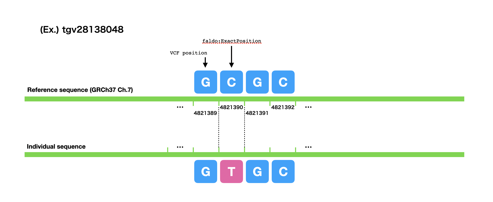
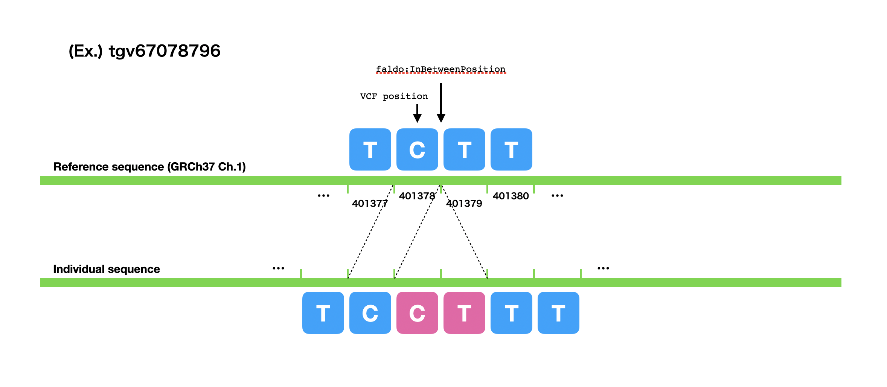
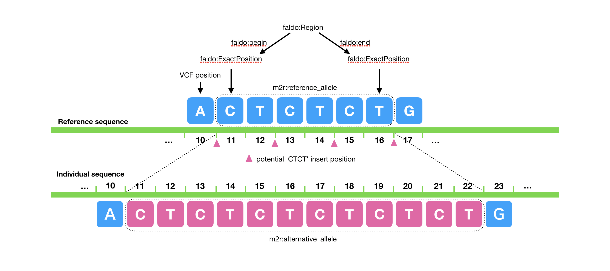

# TogoVar RDF data model

All information in [TogoVar](https://togovar.biosciencedbc.jp/) has been organized as RDF datasets. The RDF models have designed to comply with the following policies.
* As a general rule, follows to the [NBDC RDF portal guidelines](https://github.com/dbcls/rdfizing-db-guidelines).
* Sequence feature positions should be described by using the [FLADO](https://github.com/OBF/FALDO) ontology.
* [Human Chromosome Ontology (HCO)](https://github.com/med2rdf/hco):Human Chromosome Ontology should be used to refere Human chromosomes.
* [Sequence Types and Features Ontology (SO)](http://bioportal.bioontology.org/ontologies/SO) should be used to classify genomic variations. Currently, TogoVar includes five types of genetic varition, which are SNV (obo:SO_0001483), Insertion (obo:SO_0000667) , Deletion (obo:SO_0000159), Indel (obo:SO_1000032) and Substitution (obo:SO_1000002).
* [med2rdf ontology](https://github.com/med2rdf/med2rdf-ontology) should be used to describe relations between variants and allele sequences.

## Variations in TogoVar RDF

### Single Nucleotide Variation (SNV)



```turtle
@prefix rdfs: <http://www.w3.org/2000/01/rdf-schema#> .
@prefix tgv: <http://togovar.biosciencedbc.jp/variant/> .
@prefix tgvo: <http://togovar.biosciencedbc.jp/ontology/> .
@prefix obo: <http://purl.obolibrary.org/obo/> .
@prefix m2r: <http://med2rdf.org/ontology/med2rdf#> .
@prefix hco: <http://identifiers.org/hco/> .
@prefix faldo: <http://biohackathon.org/resource/faldo> .
@prefix dcterms: <http://purl.org/dc/terms/> .

tgv:tgv28138048 a obo:SO_001483, m2r:Variation ;
  dcterms:identifier "tgv28138048" ;
  faldo:location [
    a faldo:ExactPosition ;
    faldo:position 4821390 ;
    faldo:reference hco:1\/GRCh37
  ] ;
  m2r:referece_allele "C" ;
  m2r:alternative_allele "T" ;
  m2r:referece_allele_vcf "C" ;
  m2r:alternative_allele_vcf "T" .
```

### Insertion



```turtle
@prefix rdfs: <http://www.w3.org/2000/01/rdf-schema#> .
@prefix tgv: <http://togovar.biosciencedbc.jp/variant/> .
@prefix tgvo: <http://togovar.biosciencedbc.jp/ontology/> .
@prefix obo: <http://purl.obolibrary.org/obo/> .
@prefix m2r: <http://med2rdf.org/ontology/med2rdf#> .
@prefix hco: <http://identifiers.org/hco/> .
@prefix faldo: <http://biohackathon.org/resource/faldo> .
@prefix dcterms: <http://purl.org/dc/terms/> .

tgv:tgv67078796 a obo:SO_000667, m2r:Variation ;
  dcterms:identifier "tgv67078796" ;
  faldo:location [
    a faldo:InBetweenPosition ;
    faldo:after 401378 ;
    faldo:before 401379 ;
    faldo:reference hco:1\/GRCh37
  ] ;
  m2r:referece_allele "" ;
  m2r:alternative_allele "CT" ;
  m2r:referece_allele_vcf "T" ;
  m2r:alternative_allele_vcf "TCT" .
```

### Insertion with undetermined insertion position




```turtle
@prefix rdfs: <http://www.w3.org/2000/01/rdf-schema#> .
@prefix tgv: <http://togovar.biosciencedbc.jp/variant/> .
@prefix tgvo: <http://togovar.biosciencedbc.jp/ontology/> .
@prefix obo: <http://purl.obolibrary.org/obo/> .
@prefix m2r: <http://med2rdf.org/ontology/med2rdf#> .
@prefix hco: <http://identifiers.org/hco/> .
@prefix faldo: <http://biohackathon.org/resource/faldo> .
@prefix dcterms: <http://purl.org/dc/terms/> .

tgv:tgv00000000 a obo:SO_000667, m2r:Variation ;
  dcterms:identifier "tgv28138048" ;
  faldo:location [
    a faldo:Region ;
    faldo:begin [
      a faldo:ExactPosition ;
      faldo:position 11 ;
      faldo:reference hco:1\#GRCh37
    ] ;
    faldo:end [
      a faldo:ExactPosition ;
      faldo:position 16 ;
      faldo:reference hco:1\#GRCh37
    ] ;
  ] ;
  m2r:referece_allele "CTCTCT" ;
  m2r:alternative_allele "CTCTCTCTCTCT" ;
  m2r:referece_allele_vcf "TCTCTCT" ;
  m2r:alternative_allele_vcf "TCTCTCTCTCTCT" ;
  m2r:vcf_position 10 .

```
